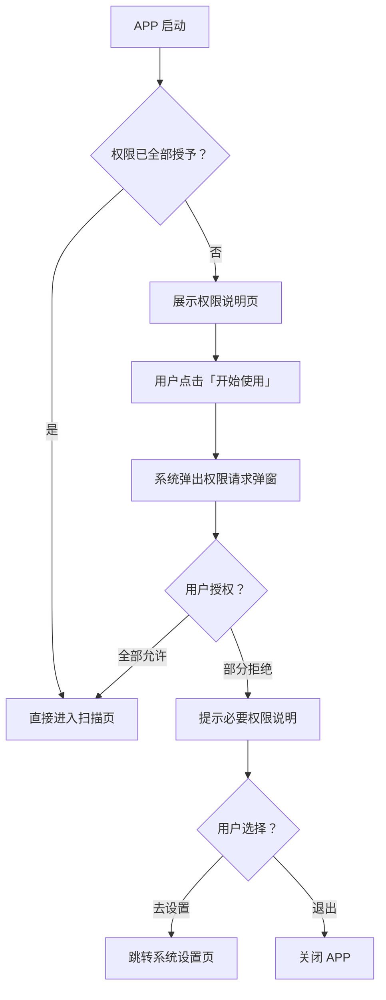
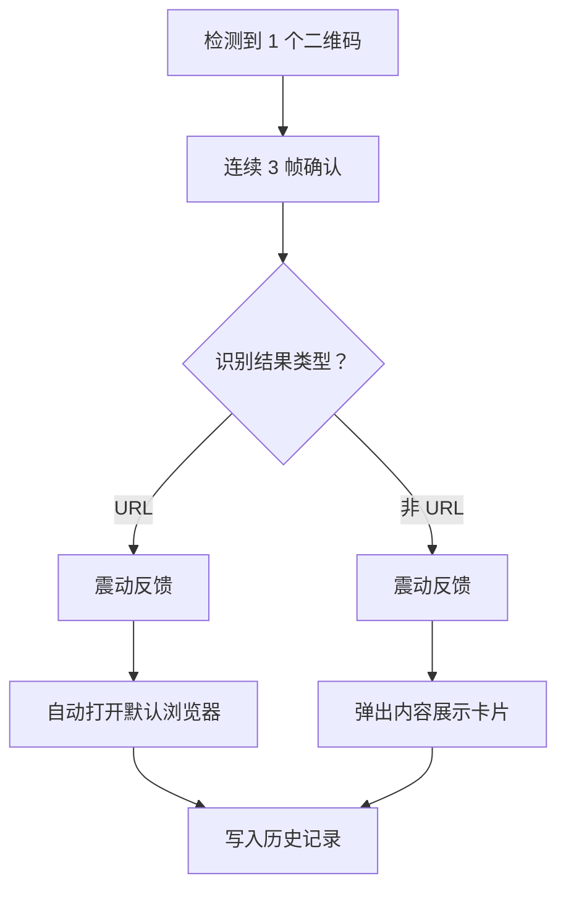
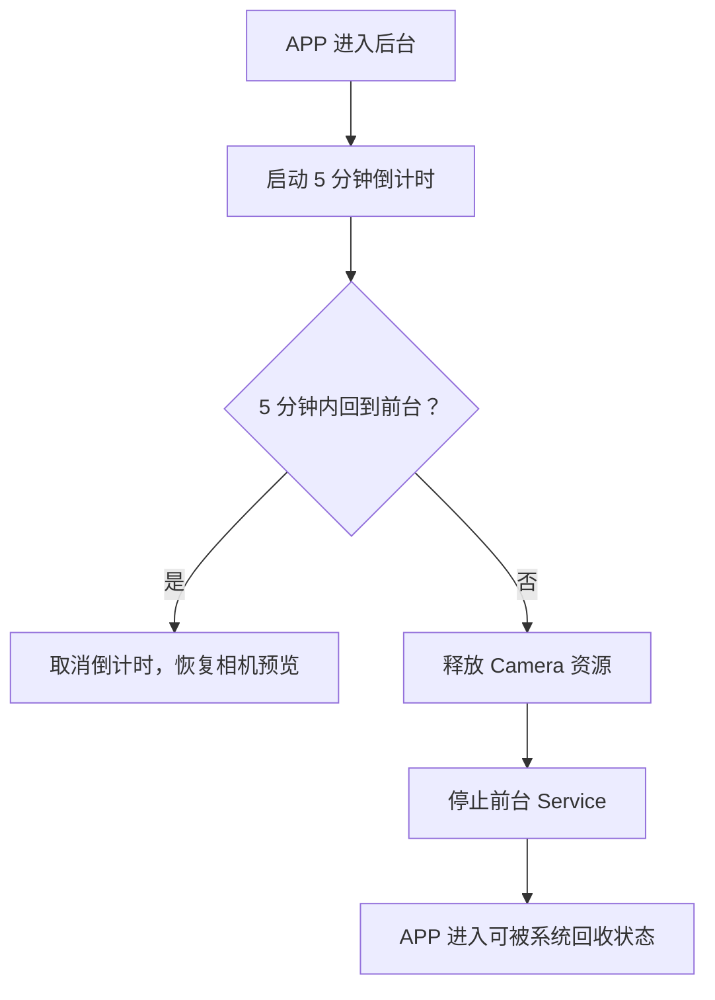
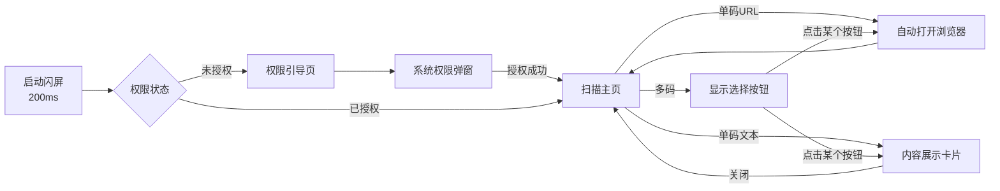

# ADR-Scan — 安卓二维码扫描工具 PRD v1.0

> **产品定位**：面向安卓平板的通用二维码快速扫描工具，免登录、零配置、开箱即用。  
> **分发方式**：APK 直装，不上架应用商店。  
> **目标设备**：Android 6.0+ 平板（兼容手机）  
> **文档版本**：v1.0 | 2026-04-29

---

## 1. 产品概述

### 1.1 核心价值主张

**一扫即达** —— 打开即扫、扫到即开、历史可查。

用户打开 APP 后无需任何操作，摄像头自动启动并实时识别画面中的二维码。单码自动跳转，多码智能定位选择，URL 自动唤起浏览器，全程零等待。

### 1.2 目标用户画像

| 维度 | 描述 |
|------|------|
| 设备 | 安卓平板（10~12 英寸为主），兼容手机 |
| 场景 | 教室、会议室、仓库等需要快速扫码的场景 |
| 技术水平 | 非技术人员，期望零学习成本 |
| 核心诉求 | 快速扫描 → 打开内容，不需要繁琐确认 |

---

## 2. 功能需求清单

### 2.1 功能矩阵

| # | 功能模块 | 优先级 | 描述 |
|---|---------|--------|------|
| F1 | 权限一次性授权 | P0 | 首次启动弹出权限请求，一次性完成所有权限授予 |
| F2 | 实时二维码扫描 | P0 | 打开即扫，使用 CameraX + ML Kit 实时识别 |
| F3 | 多码智能选择 | P0 | 画面中多个二维码时，在每个码的中心位置叠加选择按钮 |
| F4 | 单码自动跳转 | P0 | 仅检测到一个二维码时，自动执行跳转逻辑 |
| F5 | URL 自动浏览器打开 | P0 | 识别结果为 URL 时，自动调用系统默认浏览器打开 |
| F6 | 非 URL 内容展示 | P1 | 识别结果为纯文本/名片等非 URL 内容时，弹窗展示并支持复制 |
| F7 | 扫描历史记录 | P0 | 自适应布局：竖屏底部 / 横屏右侧展示历史记录列表 |
| F8 | 后台保活 | P1 | 进入后台 5 分钟内保持存活，超时后释放资源 |
| F9 | 闪光灯控制 | P2 | 暗光环境手动开关闪光灯 |

---

## 3. 详细功能规格

### 3.1 F1 — 权限一次性授权

```
触发条件：首次启动 APP 或权限被撤销后再次启动
```

**所需权限：**

| 权限 | 用途 | 必要性 |
|------|------|--------|
| `CAMERA` | 扫描二维码 | 必需 |
| `VIBRATE` | 扫描成功震动反馈 | 可选 |
| `INTERNET` | 打开 URL | 必需（默认已有） |

**交互流程：**



**设计要点：**
- 权限说明页采用全屏引导卡片样式，图标 + 一句话说明每个权限用途
- 只有一个按钮「开始使用」，点击后一次性请求所有权限
- 不使用多页 Onboarding，一页搞定

---

### 3.2 F2 — 实时二维码扫描（主页面）

**技术方案：**
- 相机：`CameraX` API（Jetpack 官方库）
- 识别：`Google ML Kit Barcode Scanning`（离线模式，无需联网）
- 支持格式：QR Code、Data Matrix、Aztec（以 QR Code 为主）

**性能指标：**

| 指标 | 目标值 |
|------|--------|
| 首帧出画 | ≤ 500ms |
| 识别延迟 | ≤ 200ms（从码入画到识别完成） |
| 帧率 | 扫描分析帧率 ≥ 15fps |
| 多码上限 | 同时识别 ≤ 10 个二维码 |

**UI 布局：**
- 相机预览占满全屏（无取景框限制，全画面识别）
- 顶部状态栏半透明覆盖
- 底部/右侧历史记录面板（可收起）

---

### 3.3 F3 — 多码智能选择

```
触发条件：画面中同时检测到 ≥ 2 个二维码
```

**交互设计：**

```
┌─────────────────────────────────┐
│          相机预览画面             │
│                                 │
│    ┌───┐         ┌───┐         │
│    │QR1│         │QR2│         │
│    └───┘         └───┘         │
│      ↓              ↓          │
│   [选择①]        [选择②]       │
│                                 │
│         ┌───┐                   │
│         │QR3│                   │
│         └───┘                   │
│           ↓                     │
│        [选择③]                  │
│                                 │
├─────────────────────────────────┤
│        扫描历史记录              │
└─────────────────────────────────┘
```

**选择按钮规格：**
- 位置：悬浮在对应二维码的**正中心**位置
- 样式：半透明圆角矩形按钮，带发光脉冲动画
- 内容：截取二维码内容前 20 字符作为预览文字（URL 显示域名）
- 跟随：按钮位置随相机画面中二维码的移动实时更新
- 大小：最小 48dp × 48dp，保证可点击

**防抖逻辑：**
- 二维码需连续 3 帧（约 200ms）被识别才显示按钮，避免闪烁
- 二维码消失后按钮延迟 500ms 再移除

---

### 3.4 F4 — 单码自动跳转

```
触发条件：画面中仅检测到 1 个二维码
```

**逻辑流程：**



**防重复触发：**
- 同一二维码内容在 **5 秒内** 不重复触发跳转
- 用户从浏览器返回后，相同码需等待 5 秒冷却期

---

### 3.5 F5 — URL 自动浏览器打开

**URL 识别规则：**
- 以 `http://`、`https://`、`ftp://` 开头 → 直接作为 URL
- 以 `www.` 开头 → 自动补全 `https://` 前缀
- 其他内容 → 视为纯文本

**打开方式：**
```kotlin
// 使用隐式 Intent 调用系统默认浏览器
val intent = Intent(Intent.ACTION_VIEW, Uri.parse(url))
startActivity(intent)
```

- **不弹确认框**，直接打开
- 无可用浏览器时 Toast 提示「未找到可用的浏览器应用」

---

### 3.6 F6 — 非 URL 内容展示

**展示方式：**
- 底部弹出卡片（Bottom Sheet）
- 显示完整二维码内容文本
- 提供「复制」按钮
- 点击空白区域或下滑关闭卡片，恢复扫描

---

### 3.7 F7 — 扫描历史记录

**布局自适应：**

| 屏幕方向 | 历史记录位置 | 高度/宽度 |
|----------|-------------|----------|
| 竖屏 | 底部面板 | 高度占屏幕 30%，可上滑展开至 70% |
| 横屏 | 右侧面板 | 宽度占屏幕 30%，可左滑展开至 50% |

**面板状态：**
- **收起态**：显示 1 行最近记录 + 向上/左箭头提示
- **展开态**：完整历史列表，支持滚动

**历史记录项：**

```
┌──────────────────────────────────┐
│ 🔗 https://example.com          │
│    2026-04-29 13:25              │
│ ─────────────────────────────── │
│ 📝 纯文本内容预览...             │
│    2026-04-29 13:20              │
│ ─────────────────────────────── │
│ 🔗 https://another-site.com     │
│    2026-04-29 13:15              │
└──────────────────────────────────┘
```

**每条记录包含：**
- 类型图标（🔗 URL / 📝 文本）
- 内容预览（URL 显示完整域名，文本显示前 50 字符）
- 扫描时间
- 点击行为：URL → 再次打开浏览器；文本 → 弹出内容卡片

**数据存储：**
- 使用 `Room` 数据库本地持久化
- 最多保留 **500 条**记录，超出后 FIFO 淘汰最旧记录
- 支持左滑单条删除

---

### 3.8 F8 — 后台保活机制

**策略：**



**实现方案：**
- 进入后台时启动 `Foreground Service`，显示通知「ADR-Scan 正在后台运行」
- 使用 `Handler.postDelayed()` 设置 5 分钟（300,000ms）定时器
- 5 分钟到期后停止 Service，释放所有资源
- 回到前台时取消定时器，重新绑定相机

---

### 3.9 F9 — 闪光灯控制

- 扫描页面右上角放置手电筒图标按钮
- 点击切换：关 → 常亮 → 关
- 状态通过图标变化反馈（灰色/黄色）

---

## 4. 技术架构

### 4.1 技术栈

| 层级 | 技术选型 | 说明 |
|------|---------|------|
| 语言 | Kotlin | Android 官方推荐 |
| 最低 API | 23 (Android 6.0) | 覆盖 97%+ 设备 |
| 目标 API | 34 (Android 14) | 最新适配 |
| UI 框架 | Jetpack Compose | 现代声明式 UI |
| 相机 | CameraX | Jetpack 相机库 |
| 二维码识别 | ML Kit Barcode Scanning | Google 离线识别 |
| 数据库 | Room | 本地历史记录持久化 |
| 依赖注入 | Hilt | 轻量级 DI |
| 构建工具 | Gradle (Kotlin DSL) | 标准构建 |

### 4.2 项目架构

```
app/
├── src/main/
│   ├── java/com/adrscan/
│   │   ├── MainActivity.kt              # 入口 Activity
│   │   ├── AdrscanApp.kt                # Application 类
│   │   │
│   │   ├── ui/                           # UI 层
│   │   │   ├── theme/                    # 主题配置
│   │   │   │   ├── Theme.kt
│   │   │   │   ├── Color.kt
│   │   │   │   └── Type.kt
│   │   │   ├── screen/
│   │   │   │   ├── ScanScreen.kt         # 扫描主页面
│   │   │   │   └── PermissionScreen.kt   # 权限引导页
│   │   │   └── component/
│   │   │       ├── CameraPreview.kt      # 相机预览组件
│   │   │       ├── QrOverlay.kt          # 二维码叠加按钮层
│   │   │       ├── HistoryPanel.kt       # 历史记录面板
│   │   │       ├── ContentSheet.kt       # 非URL内容展示卡片
│   │   │       └── FlashToggle.kt        # 闪光灯开关
│   │   │
│   │   ├── scanner/                      # 扫描核心逻辑
│   │   │   ├── QrAnalyzer.kt            # ML Kit 图像分析器
│   │   │   └── QrResult.kt              # 扫描结果数据类
│   │   │
│   │   ├── data/                         # 数据层
│   │   │   ├── ScanRecord.kt            # Room Entity
│   │   │   ├── ScanDao.kt               # Room DAO
│   │   │   └── ScanDatabase.kt          # Room Database
│   │   │
│   │   ├── service/                      # 后台服务
│   │   │   └── KeepAliveService.kt      # 保活前台服务
│   │   │
│   │   └── util/                         # 工具类
│   │       ├── UrlHelper.kt             # URL 识别与处理
│   │       └── VibrateHelper.kt         # 震动反馈
│   │
│   ├── res/
│   │   ├── drawable/                     # 图标资源
│   │   ├── values/
│   │   │   ├── strings.xml
│   │   │   └── themes.xml
│   │   └── mipmap/                       # APP 图标
│   │
│   └── AndroidManifest.xml
│
├── build.gradle.kts
└── proguard-rules.pro
```

### 4.3 核心依赖

```kotlin
// CameraX
implementation("androidx.camera:camera-camera2:1.3.1")
implementation("androidx.camera:camera-lifecycle:1.3.1")
implementation("androidx.camera:camera-view:1.3.1")

// ML Kit Barcode
implementation("com.google.mlkit:barcode-scanning:17.2.0")

// Jetpack Compose
implementation(platform("androidx.compose:compose-bom:2024.02.00"))
implementation("androidx.compose.material3:material3")
implementation("androidx.compose.ui:ui")

// Room
implementation("androidx.room:room-runtime:2.6.1")
implementation("androidx.room:room-ktx:2.6.1")
kapt("androidx.room:room-compiler:2.6.1")

// Hilt
implementation("com.google.dagger:hilt-android:2.50")
kapt("com.google.dagger:hilt-compiler:2.50")
```

---

## 5. UI/UX 设计规范

### 5.1 设计语言

- **风格**：Material Design 3（Material You）
- **主色调**：深蓝色系（`#1A237E` 为主色）
- **强调色**：亮青色（`#00BCD4`）用于选择按钮和交互反馈
- **背景**：相机实时画面，UI 元素使用半透明毛玻璃效果

### 5.2 页面流转



### 5.3 动效规范

| 动效 | 时长 | 缓动曲线 | 说明 |
|------|------|---------|------|
| 选择按钮出现 | 200ms | EaseOut | 从 0 缩放到 1 |
| 选择按钮脉冲 | 1500ms | 循环 | 外圈光晕呼吸效果 |
| 历史面板展开 | 300ms | EaseInOut | 弹簧阻尼动画 |
| 内容卡片弹出 | 250ms | EaseOut | 从底部滑入 |
| 扫描成功反馈 | 100ms | - | 短震动 + 按钮高亮闪烁 |

---

## 6. 非功能需求

### 6.1 性能

| 指标 | 要求 |
|------|------|
| 冷启动时间 | ≤ 1.5 秒（到相机出画） |
| APK 体积 | ≤ 15MB |
| 内存占用 | ≤ 80MB（扫描运行时） |
| 电池消耗 | 连续使用 1 小时消耗 ≤ 8% |

### 6.2 兼容性

| 项目 | 范围 |
|------|------|
| Android 版本 | 6.0 (API 23) ~ 14 (API 34) |
| 屏幕尺寸 | 7 英寸 ~ 13 英寸平板为主 |
| 屏幕方向 | 竖屏 + 横屏均完整支持 |
| 分辨率 | 自适应，支持 mdpi ~ xxxhdpi |

### 6.3 稳定性

- 崩溃率目标 < 0.1%
- 相机异常（被占用/不可用）时 graceful 提示，不崩溃
- 无网络环境下扫描功能正常（ML Kit 离线识别）

---

## 7. 安全与隐私

- **无网络请求**：APP 本身不与任何服务器通信
- **无数据上传**：所有扫描记录仅存本地
- **无登录系统**：零用户数据收集
- **相机数据**：仅用于实时分析，不录制不存储图像
- **最小权限原则**：仅申请 CAMERA 和 VIBRATE

---

## 8. 开发里程碑

| 阶段 | 内容 | 预估耗时 |
|------|------|---------|
| M1 | 项目初始化 + CameraX 集成 + 基础 UI 框架 | 0.5 天 |
| M2 | ML Kit 集成 + 单码自动识别跳转 | 0.5 天 |
| M3 | 多码检测 + 叠加选择按钮 + 坐标映射 | 1 天 |
| M4 | 历史记录面板 + Room 持久化 + 自适应布局 | 0.5 天 |
| M5 | 权限引导页 + 后台保活 + 闪光灯 | 0.5 天 |
| M6 | UI 打磨 + 动效 + 全设备测试 + 打包 | 0.5 天 |
| **合计** | | **~3 天** |

---

## 9. 开放问题 & 待确认

| # | 问题 | 建议 | 状态 |
|---|------|------|------|
| Q1 | APP 名称确认？当前暂定「ADR-Scan」 | 可改为中文名「极速扫码」 | ⏳ 待确认 |
| Q2 | APP 图标是否需要专门设计？ | 建议简洁的 QR 图标 + 品牌色 | ⏳ 待确认 |
| Q3 | 历史记录是否需要「全部清除」功能？ | 建议加上 | ⏳ 待确认 |
| Q4 | 是否需要支持从相册选图识别二维码？ | 作为 P2 后续迭代 | ⏳ 待确认 |
| Q5 | 扫描成功音效是否需要？ | 建议仅震动，无声音 | ⏳ 待确认 |
| Q6 | 是否需要支持条形码（Barcode）？ | ML Kit 天然支持，可低成本加入 | ⏳ 待确认 |
| Q7 | 暗色主题是否需要？（当前为暗色相机背景 + 亮色 UI 元素） | 相机场景天然暗色，无需额外主题 | ⏳ 待确认 |

---

## ChangeLog

| 日期 | 版本 | 变更内容 |
|------|------|---------|
| 2026-04-29 | v1.0 | 初版 PRD，覆盖全部核心功能需求 |
